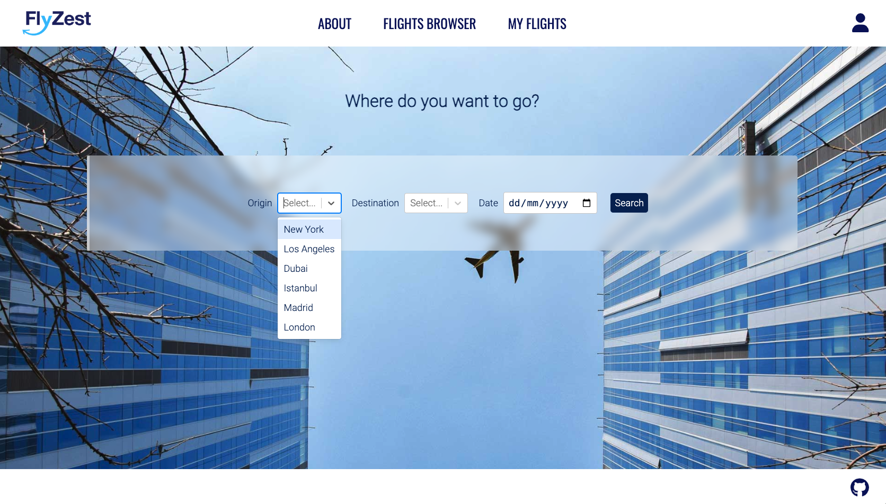
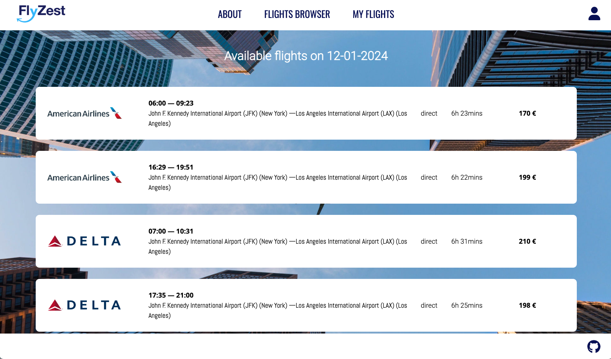
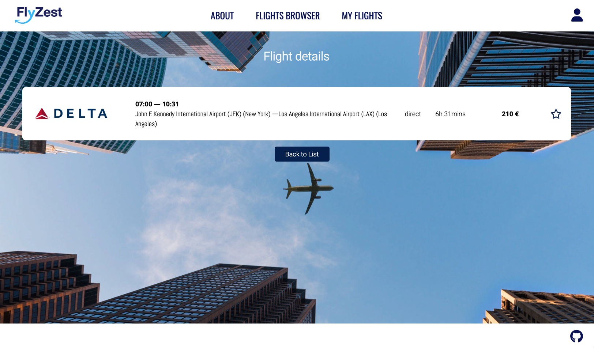
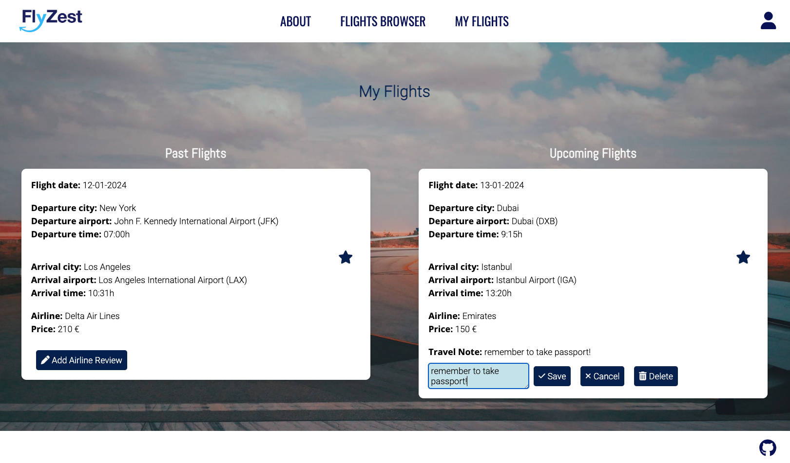
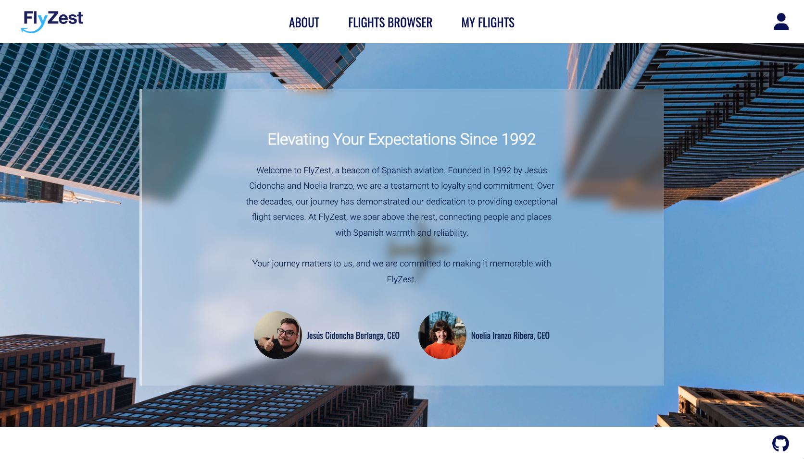
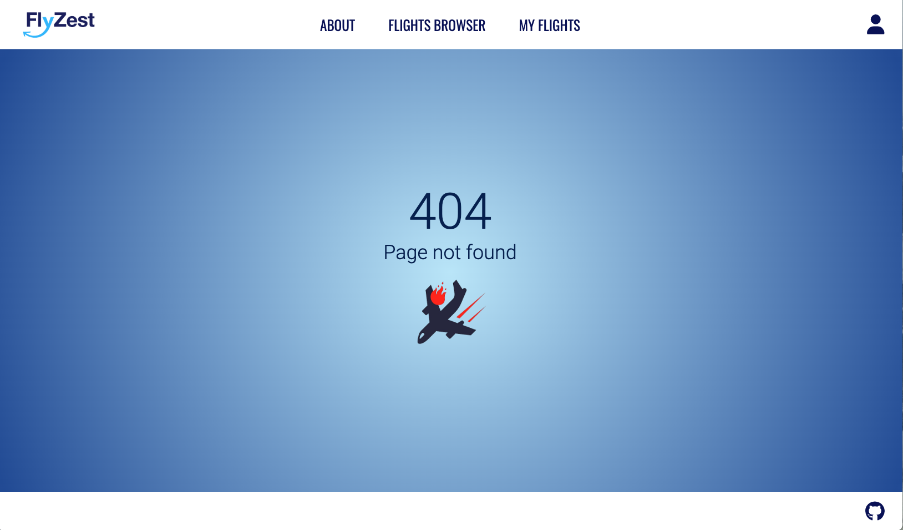

#  FlyZest flights browser

## [Link to deployed app](https://flyzestfrontend.netlify.app/)

# Project Description

Our project is a Single Page Application (SPA) website made with React. It serves as a flight browser that enables users to browse and select flights from a predefined list of options. These options are defined by a REST API created using JSON server. 

# App Functionalities 

The FlyZest web app contains 6 different pages:

## Home Page 

The Home Page is the initial screen that users see upon opening the app. This page features a flight browser, enabling users to choose from a predefined list of origins and destinations. As for flight dates, the JSON server only contains flights from 10-01-2024 to 13-01-2024. If users select dates outside of this range, they will be prompted to return to the flight browser and select a new date. 
When users click on the search button, they are redirected to the Flights List Page. 

## Flights List Page

The Flights List Page displays a list of flights that match the user's search criteria. 
Each flight card displays the following information: the logo of the airline operating the flight, flight departure and arrival times, flight departure airport and city, flight arrival airport and city, flight duration, and price. When users click on a flight of interest, they are dynamically redirected to the Flight Details Page. 

## Flight Details Page

The Flight Details Page displays information about the selected flight, identical to the information presented on the Flights List Page. On the right side of the flight card, a star button allows users to save or remove the flight from the My Flights Page. Additionally, a button is provided for users to navigate back to the Flights List Page.

## My Flights Page

The My Flights Page presents the flights that the user has saved, including both past and upcoming flights. Each flight card has the following features:

- It displays the flight information.
- It allows the user to remove a specific flight from their saved list.
- For past flights, it enables the user to add, edit, or delete an airline review.
- For upcoming flights, it enables the user to add, edit, or delete a travel note.

## About Page 

The About Page displays a little bit of information about the fictitious company, FlyZest, founded by the app creators: Jesús Cidoncha Berlanga, and Noelia Iranzo Ribera.

## Error Page

The Error Page displays a 404 error, along with a humorous image of a plane crashing, consistent with the website's theme.  

## Backlog Functionalities

- Glitch: Fix the DELETE (CRUD) operation so that it doesn't require a page reload.
- Glitch: Modify the DELETE operation to handle item-specific changes, instead of deleting all travel notes or airline reviews.
- Use an external API, rather than a REST API, to provide a larger set of data and thereby enhance the functionality of the application. 
- Implement a login feature.
- Implement a filter feature (by flight departure time and price) in the Flights List Page.
- Introduce 'airline reviews' as a separate object with multiple properties, such as 'comment' and 'rating'. Display airlines' reviews and average ratings on a separate page.

 
# Technologies Used
- React
- CSS
- JSON server

# Extra Links 

### Slides
[Link to presentation slides](https://docs.google.com/presentation/d/1noDRgiKQhqksLUwoKEyUr6kUZ8L9FziTVdOgVLsWPr4/edit#slide=id.gf641ff9b39_1_0)

## Repo
- [Link to frontend repo](https://github.com/niranzri/m2project-frontend)
- [Link to backend repo](https://github.com/niranzri/m2project-backend)